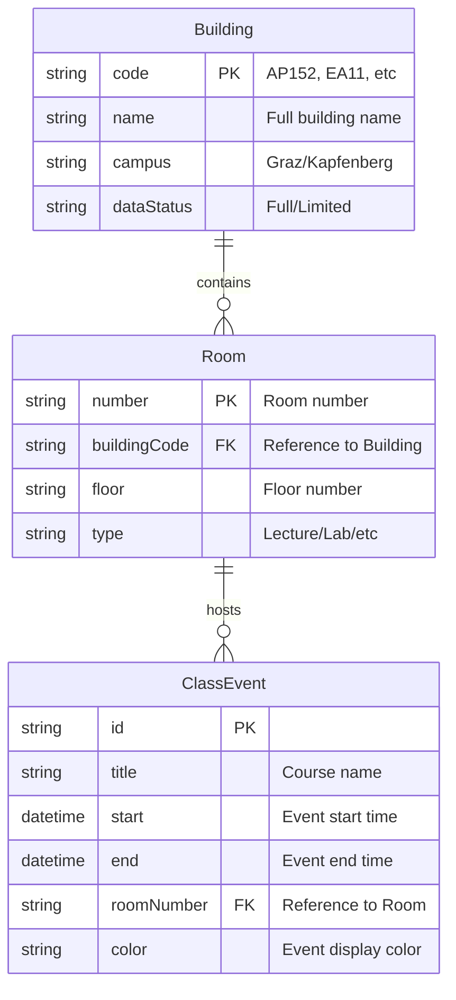

# FH Joanneum Room Scheduling App

A modern Angular/Ionic application for viewing and managing room schedules at FH Joanneum. This app provides real-time access to classroom schedules, free room availability, and building information across multiple FH Joanneum campuses.

## 🏗️ Current Project Status

### Architecture
- **Framework**: Angular 18.2.13 with Ionic 7.0.0
- **Mobile Support**: Capacitor 6.0.0 for native mobile deployment
- **Calendar Integration**: Mobiscroll Angular components
- **Database**: Dexie (IndexedDB wrapper) for offline storage
- **Styling**: SCSS with Ionic components
- **Build System**: Angular CLI with TypeScript 5.5.4

### Current Features Implemented

#### ✅ Core Functionality
- **Building Selection**: Choose from multiple FH Joanneum buildings (AP152, AP147, AP149, AP154, EA11, EA9, EA13, ES30i, ES7a, ES7b)
- **Room Schedule Viewing**: Daily schedule display with time slots and event details
- **Free Room Discovery**: Real-time calculation of available rooms with duration estimates
- **Advanced Filtering**: Filter by floor, specific rooms, and search by course/lecturer name
- **Responsive Design**: Works on desktop, tablet, and mobile devices

#### ✅ User Interface
- **Onboarding Flow**: Building selection and app introduction
- **Home Page**: Current day schedule with events timeline
- **Free Rooms Page**: Available rooms categorized by "Free Now" and "Free Soon"
- **Calendar View**: Monthly calendar interface (basic implementation)
- **Room Details Modal**: Detailed daily timeline for individual rooms

#### ✅ Data Management
- **Local Storage**: Persistent building selection and user preferences
- **Mock Data System**: Comprehensive test dataset with real FH Joanneum schedule data
- **Room Structure Analysis**: Automatic floor and room extraction from schedule data
- **Event Processing**: Smart parsing of course titles, rooms, and time slots

#### ✅ Technical Infrastructure
- **Service Architecture**: Modular services for events, rooms, authentication, and storage
- **Factory Pattern**: Data transformation and object creation
- **Guard System**: Route protection (authentication ready)
- **HTTP Interceptors**: Request/response processing pipeline
- **Environment Configuration**: Development and production environment separation

## 🔄 What Needs to Be Done

### 1. API Integration (High Priority)

#### Current State:
- App currently uses mock data from `src/assets/mock-events.json`
- Basic API service structure in place but connecting to non-functional endpoint
- Environment configured with FH Joanneum API URL: `https://almaty.fh-joanneum.at/stundenplan/json.php`

#### Required Implementation:
```typescript
// API Integration Roadmap
- ✅ Environment configuration ready
- ❌ CORS proxy configuration needed
- ❌ Real API parameter formatting (submit=Suche&q=[BuildingCode])
- ❌ Error handling and fallback mechanisms
- ❌ Response data transformation from FH format
- ❌ Caching strategy for offline functionality
- ❌ Rate limiting and request optimization
```

#### API Specifications:
- **Endpoint**: `https://almaty.fh-joanneum.at/stundenplan/json.php`
- **Parameters**: `submit=Suche&q=[Building Code]`
- **Buildings**: AP152, AP147, AP149, AP154, EA11, EA9, EA13, ES30i, ES7a, ES7b
- **Response Format**: JSON array of schedule events
- **CORS Issue**: Requires proxy configuration or serverless function

### 2. Security Implementation (Critical Priority)

#### Current Security Status:
```typescript
// Security Assessment
- ⚠️  Basic authentication service exists but incomplete
- ⚠️  Token management system in place but not validated
- ⚠️  No input sanitization visible
- ⚠️  Local storage used for sensitive data
- ⚠️  No HTTPS enforcement
- ⚠️  Missing CORS headers handling
- ⚠️  No rate limiting implementation
- ⚠️  Dependency vulnerabilities need audit
```

#### Required Security Enhancements:
1. **Authentication & Authorization**
   - Implement OAuth 2.0 or JWT token system
   - Add proper session management
   - Token expiration and refresh mechanisms
   - Role-based access control (student/faculty/admin)

2. **Data Protection**
   - Input validation and sanitization
   - XSS prevention
   - CSRF protection
   - Secure API communication (HTTPS only)
   - Encrypted local storage for sensitive data

3. **Infrastructure Security**
   - Content Security Policy (CSP) headers
   - CORS configuration
   - Rate limiting and DDoS protection
   - Security headers implementation
   - Dependency vulnerability scanning

### 3. Feature Enhancements (Medium Priority)

#### Enhanced Room Management
- **Room Booking System**: Allow users to reserve available rooms
- **Conflict Detection**: Real-time booking conflict prevention
- **Recurring Events**: Support for weekly/monthly recurring classes
- **Room Equipment Info**: Display available equipment (projectors, whiteboards, etc.)

#### Notification System
- **Push Notifications**: Class reminders and room availability alerts
- **Email Integration**: Schedule summaries and updates
- **Calendar Sync**: Integration with Google Calendar, Outlook
- **Customizable Alerts**: Personal notification preferences

#### Analytics & Reporting
- **Usage Statistics**: Room utilization analytics
- **Popular Times**: Peak usage patterns
- **Export Functionality**: PDF/CSV schedule exports
- **Attendance Tracking**: Basic class attendance features

#### Advanced UI/UX
- **Dark Mode**: System-wide dark theme support
- **Accessibility**: WCAG 2.1 compliance
- **Multi-language**: German/English language switching
- **Offline Mode**: Full offline functionality with sync
- **Progressive Web App**: Install as native app

### 4. Mobile App Deployment (Medium Priority)

#### Current Mobile Support:
- Capacitor configuration ready
- Android scheme configured
- iOS deployment preparation needed

#### Required Mobile Features:
- **Native Navigation**: Platform-specific navigation patterns
- **Camera Integration**: QR code scanning for room access
- **Geolocation**: Building navigation and room finding
- **Biometric Authentication**: Fingerprint/Face ID login
- **Background Sync**: Automatic schedule updates
- **Push Notifications**: Native mobile notifications

### 5. Performance & Scalability (Low Priority)

#### Current Performance:
- Basic Angular optimization
- Lazy loading for routes implemented
- No advanced caching strategy

#### Optimization Roadmap:
- **Caching Strategy**: Smart data caching and cache invalidation
- **Bundle Optimization**: Tree shaking and code splitting
- **Image Optimization**: WebP support and lazy loading
- **Service Worker**: Advanced PWA features
- **CDN Integration**: Static asset delivery optimization
- **Database Optimization**: Efficient data querying and indexing

## 🔧 Development Setup

### Prerequisites
- Node.js 18+ and npm 8+
- Angular CLI 18+
- Ionic CLI 7+
- Capacitor CLI (for mobile development)

### Installation
```bash
# Clone repository
git clone [repository-url]
cd fh-group-1-main

# Install dependencies
npm install

# Start development server
npm run start
# App will be available at http://localhost:8100
```

### Build Commands
```bash
# Development build
npm run build

# Production build
ng build --configuration production

# Mobile build (Android)
npx cap add android
npx cap run android

# Mobile build (iOS)
npx cap add ios
npx cap run ios
```

## 🏢 Building Codes Reference

| Building | Code | Campus | Data Status |
|----------|------|--------|-------------|
| Alte Poststraße 152 | AP152 | Graz | ✅ Full Data |
| Alte Poststraße 147 | AP147 | Graz | ✅ Full Data |
| Alte Poststraße 149 | AP149 | Graz | ✅ Full Data |
| Alte Poststraße 154 | AP154 | Graz | ✅ Full Data |
| Eggenberger Allee 11 | EA11 | Graz | ✅ Full Data |
| Eggenberger Allee 9 | EA9 | Graz | ⚠️ Limited Data |
| Eggenberger Allee 13 | EA13 | Graz | ✅ Full Data |
| Eckertstraße 30i | ES30i | Kapfenberg | ✅ Full Data |
| Eckertstraße 7a | ES7a | Kapfenberg | ⚠️ Limited Data |
| Eckertstraße 7b | ES7b | Kapfenberg | ⚠️ Limited Data |

## 🏗️ Backend Architecture & Data Model

### Entity Relationship Diagram

The following diagram illustrates the current data model and entity relationships within the application:



### Key Entity Relationships:

1. **Building to Room (1:Many)**
   - Each building contains multiple rooms
   - Rooms are uniquely identified by their number within a building
   - Building code is used as a foreign key in Room entity

2. **Room to ClassEvent (1:Many)**
   - Each room can host multiple class events
   - Events are linked to specific rooms through the room number
   - Room number is used as a foreign key in ClassEvent entity

3. **Data Flow**
   - Building selection determines available rooms
   - Room selection filters relevant class events
   - Events are displayed in calendar and timeline views

### Service Architecture

#### Core Services Layer

```typescript
// Core Infrastructure Services
├── HttpService              // HTTP client wrapper with error handling
│   ├── URL generation with environment-based routing
│   ├── Automatic retry mechanism
│   ├── Centralized error handling with status code mapping
│   ├── Support for custom headers and authentication
│   └── RESTful operations (GET, POST, PUT, DELETE, PATCH)
│
├── StorageService          // Local/Session storage abstraction
│   ├── Prefixed key management (app_design_)
│   ├── JSON serialization/deserialization
│   ├── Session vs localStorage selection
│   └── Type-safe storage operations
│
├── AuthService             // Authentication & session management
│   ├── Token lifecycle management
│   ├── User profile caching
│   ├── Automatic logout on token expiry
│   └── Route guard integration
│
└── DataEntriesService      // Generic data operations
    ├── CRUD operations abstraction
    ├── Pagination support
    └── Search and filtering
```

#### Business Logic Services

```typescript
// Domain-Specific Services
├── ClassEventsService      // Schedule and event management
│   ├── Mock data integration (current)
│   ├── Date-based filtering
│   ├── Building-specific queries
│   ├── Error handling with fallback to mock data
│   └── Event transformation via ClassEventFactory
│
├── RoomService            // Room availability and management
│   ├── Building-based room queries
│   ├── Real-time availability calculation
│   ├── Room status tracking (free/occupied)
│   └── Future availability prediction
│
└── Device Services        // Capacitor-based native features
    ├── CameraService      // Photo capture and QR scanning
    ├── FilesystemService  // File operations and storage
    └── VoiceRecorderService // Audio recording capabilities
```

### Data Processing Logic

#### 1. Schedule Data Transformation

The `ClassEventFactory` implements sophisticated data parsing logic:

```typescript
// Raw FH Joanneum API Response Processing
Input: "Sonderlehrveranstaltung 2. Semester, -, Standardgruppe, AP152.02.210 (AUD 2024)"

Processing Steps:
1. Split title by commas → ["Sonderlehrveranstaltung 2. Semester", "-", "Standardgruppe", "AP152.02.210 (AUD 2024)"]
2. Extract room code → "AP152.02.210 (AUD 2024)"
3. Remove parenthetical info → "AP152.02.210"  
4. Parse building.floor.room → ["AP152", "02", "210"]

Output: ClassEvent {
  tmp: "AP152.02.210",    // Full room code
  room: "210",            // Room number only
  // ... other properties
}
```

#### 2. Room Structure Analysis

Dynamic room hierarchy extraction from schedule data:

```typescript
// Room Structure Generation Algorithm
extractRoomStructure(events: ClassEvent[]) {
  const floors: {[key: string]: Set<string>} = {};
  const rooms = new Set<string>();

  events.forEach(event => {
    const [building, floor, room] = event.tmp.split('.');
    
    // Build hierarchical structure
    if (!floors[floor]) floors[floor] = new Set<string>();
    floors[floor].add(room);
    rooms.add(room);
  });

  // Convert to sorted arrays for UI consumption
  this.roomStructure = {
    floors: Object.fromEntries(
      Object.entries(floors).map(([floor, roomSet]) => [
        floor, Array.from(roomSet).sort()
      ])
    ),
    rooms: Array.from(rooms).sort()
  };
}
```

#### 3. Free Time Slot Calculation

Advanced algorithm for calculating room availability:

```typescript
// Free Room Algorithm Logic
calculateFreeTimeSlots() {
  const BUILDING_HOURS = { open: '08:00', close: '18:15' };
  
  // For each room in the building
  allRooms.forEach(room => {
    const events = getEventsForRoom(room);
    const freeSlots = [];
    
    // Check availability before first event
    if (firstEvent.start > BUILDING_HOURS.open) {
      freeSlots.push(createSlot(BUILDING_HOURS.open, firstEvent.start));
    }
    
    // Check gaps between events
    for (let i = 0; i < events.length - 1; i++) {
      const gap = calculateGap(events[i].end, events[i + 1].start);
      if (gap > MIN_USEFUL_DURATION) {
        freeSlots.push(createSlot(events[i].end, events[i + 1].start));
      }
    }
    
    // Check availability after last event
    if (lastEvent.end < BUILDING_HOURS.close) {
      freeSlots.push(createSlot(lastEvent.end, BUILDING_HOURS.close));
    }
  });
}
```

### Design Patterns Implementation

#### 1. Factory Pattern
```typescript
// Consistent object creation and transformation
ClassEventFactory.fromObject(rawData) // Individual transformation
ClassEventFactory.fromArray(rawArray) // Batch processing
UserFactory.fromObject(userData)       // User profile creation
AuthTokenFactory.fromObject(tokenData) // Authentication tokens
```

#### 2. Service Layer Pattern
```typescript
// Separation of concerns with dependency injection
@Injectable({ providedIn: 'root' })
export class ClassEventsService {
  constructor(private http: HttpClient) {}
  
  // Business logic encapsulation
  loadClassEvents(params: LoadEventsParams): Observable<ClassEvent[]>
}
```

#### 3. Observer Pattern
```typescript
// Reactive programming with RxJS
loadEvents().subscribe({
  next: (events) => this.processEvents(events),
  error: (error) => this.handleError(error),
  complete: () => this.finalizeParsing()
});
```

#### 4. Guard Pattern
```typescript
// Route protection and access control
@Injectable()
export class AuthGuard implements CanActivate {
  canActivate(): boolean {
    return AuthService.isAuth();
  }
}
```

### Development Architecture Decisions

#### 1. **Data Layer Strategy**
- **Current**: Mock data with realistic FH Joanneum schedule structure
- **Rationale**: Enables full frontend development without API dependencies
- **Benefits**: Consistent development experience, offline-first approach

#### 2. **Error Handling Philosophy**
```typescript
// Graceful degradation approach
catchError(() => {
  console.log('Using mock data due to API error');
  return of(ClassEventFactory.fromArray(mockEvents));
})
```

#### 3. **State Management**
- **Storage**: Local/session storage for user preferences
- **Runtime**: Service-based state with RxJS observables
- **Persistence**: Building selection, authentication tokens

#### 4. **Code Organization**
```
├── interfaces/     // TypeScript contracts
├── factories/      // Data transformation
├── services/       // Business logic
├── guards/         // Access control
├── interceptors/   // HTTP middleware
└── stores/         // State management
```

## 📁 Project Structure

```
src/app/
├── components/           # Reusable UI components
├── factories/           # Data transformation classes
├── guards/              # Route protection
├── interceptors/        # HTTP request/response handling
├── interfaces/          # TypeScript type definitions
├── library/             # Shared component library
├── pages/               # Application pages
│   ├── home/           # Main schedule view
│   ├── free-rooms/     # Available rooms
│   ├── calendar/       # Calendar interface
│   ├── onboarding/     # App introduction
│   └── login/          # Authentication
├── services/            # Business logic services
├── stores/              # State management
└── tables/              # Database configurations
```

## 🤝 Contributing

This is an academic project for FH Joanneum. Current development focuses on:
1. Completing API integration with real FH Joanneum data
2. Implementing comprehensive security measures
3. Enhancing user experience and mobile functionality

## 📄 License

Academic project for FH Joanneum - All rights reserved.

## 🆘 Known Issues & Limitations

1. **API Integration**: Currently using mock data due to CORS restrictions
2. **Authentication**: Basic system exists but not production-ready
3. **Mobile**: Capacitor configured but native features not implemented
4. **Offline Mode**: Limited offline functionality
5. **Real-time Updates**: No live data synchronization
6. **Performance**: Large datasets may cause performance issues
7. **Error Handling**: Basic error handling needs improvement

---

**Last Updated**: June 2025  
**Version**: 0.0.1  
**Status**: Active Development 
 
